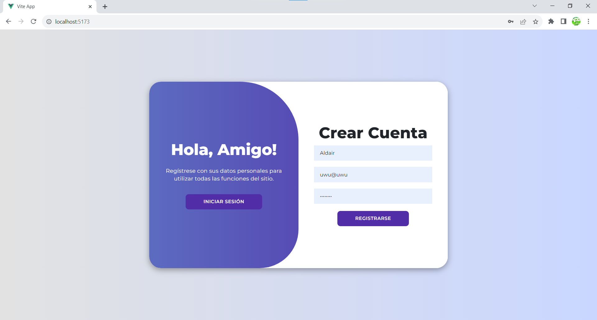
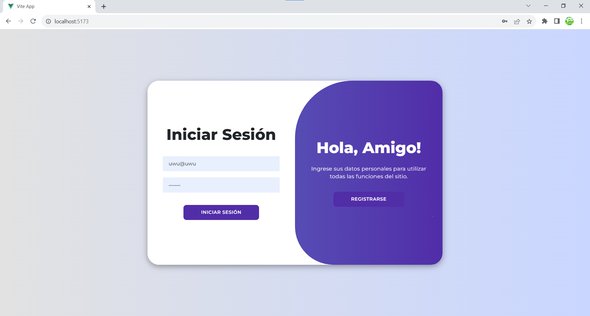
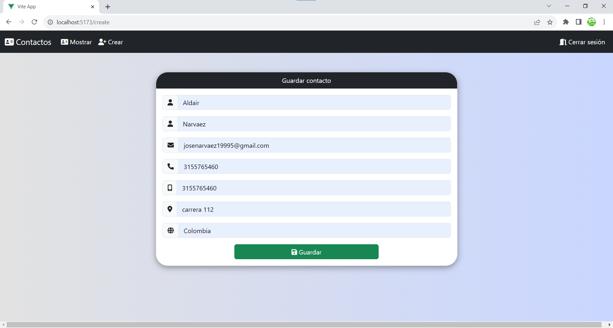
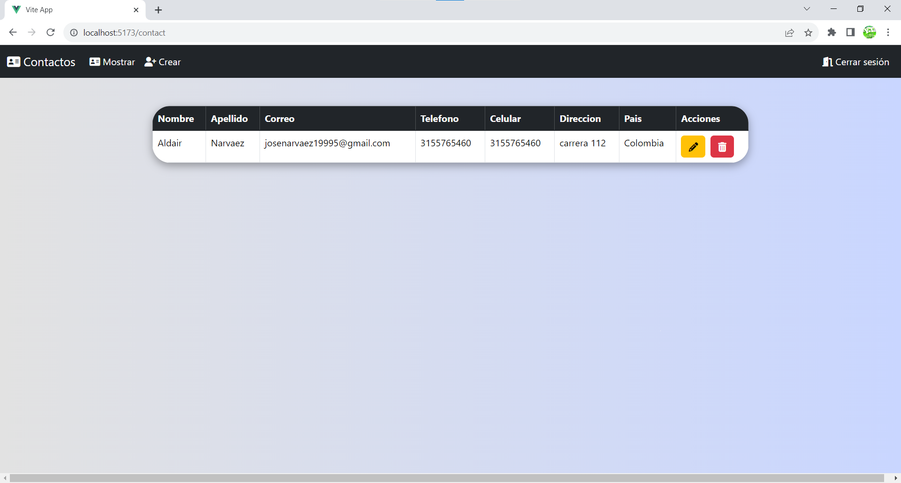
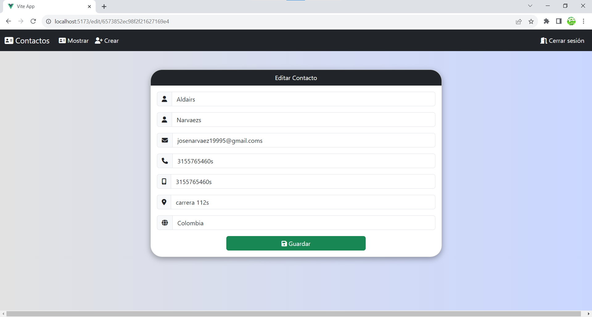

# Proyecto CRUD con Autenticación JWT

Este proyecto es un CRUD que incluye un sistema de login con verificación JWT (JSON Web Tokens). Permite a los usuarios realizar operaciones CRUD en contactos, cada uno asociado a un único usuario.

## Tabla de Contenidos

- [Instalación](#instalación)
- [Uso](#uso)
- [Estructura del Proyecto](#estructura-del-proyecto)
- [Tecnologías Utilizadas](#tecnologías-utilizadas)
- [Contribución](#contribución)
- [Licencia](#licencia)

## Instalación

Sigue estos pasos para instalar las dependencias del proyecto:

```bash
cd server
npm install
npm install axios@^1.6.2
npm install bcrypt@^5.1.1
npm install cors@^2.8.5
npm install crypto@^1.0.1
npm install express@^4.18.2
npm install jwt-simple@^0.5.6
npm install moment@^2.29.4
npm install mongoose@^8.0.1
cd ..
cd client
npm install
npm install @fortawesome/fontawesome-free@^6.5.1
npm install axios@^1.6.2
npm install bootstrap@^5.3.2
npm install sweetalert2@^11.10.1
npm install vue@^3.3.10
npm install vue-router@^4.2.5
npm install vite@^4.4.11 -D
```

## Uso

Sigue estos pasos para ejecutar el proyecto:

### 1. Iniciar el Servidor

En la carpeta del servidor, ejecuta el siguiente comando en tu terminal:

```bash
cd server
node server.js
```
Abre otra terminal, ve a la carpeta del cliente y ejecuta el siguiente comando:

```bash
cd client
npm run dev
```

### 2. Acceder al Proyecto

Abre tu navegador web y ve a http://localhost:5173 para acceder al proyecto.

### 3. Instrucciones de uso

#### 1. Registro

Lo primero que veras sera un inico de sesion haz click en la opcion que dice registrarse y llena el formulario y dale click en registrarse.



#### 2. Iniciar sesión

Una vez registrado dale click en iniciar sesión y llena el formulario y dale clik en iniciar sesión



#### 3. Crear Contactos

Dale click en la barra de navegacion a Crear y llena el formulario y dale click en guardar



#### 4. Ver contactos

Dale click en la bara de navegacion a Mostrar o Contactos



#### 5. Editar contactos

Dale click en el icono de lapiz al contacto que quieras editar y cambia los campos que desees editar y dale clik en guardar



#### 6. Eliminar contactos

Dale click en el icono de basura al contacto que desees eliminar

## Estrucura del proyecto

CRUD
|-- client
|   |-- .vscode
|   |-- node_modules
|   |-- public
|   |-- src
|   |   |-- assets
|   |   |-- components
|   |   |-- interceptors
|   |   |-- router
|   |   |-- views
|   |   |-- App.vue
|   |   |-- main.js
|   |   |-- funciones.js
|   |-- index.html
|   |-- package-lock.json
|   |-- package.json
|   |-- vite.config.js
|-- server
|   |-- controllers
|   |-- middlewares
|   |-- models
|   |-- node_modules
|   |-- routes
|   |-- services
|   |-- cofig.js
|   |-- package-lock.json
|   |-- package.json
|   |-- server.js
|-- imagenes
|-- README.md

## Tecnologías Utilizadas

### (Backend)

Este proyecto utiliza las siguientes tecnologías:

- **Node.js y Express**: Para la creación del servidor backend.
- **MongoDB**: Como base de datos NoSQL.
- **Axios**: Utilizado para realizar solicitudes HTTP desde el lado del cliente (posiblemente para la comunicación entre el frontend y el backend).
- **Bcrypt**: Para el hashing de contraseñas, comúnmente utilizado en autenticación.
- **Cors**: Para habilitar el manejo de solicitudes CORS en tu servidor Express.
- **Crypto**: Aunque no se especifica un uso directo en tu `package.json`, es comúnmente utilizado para operaciones criptográficas en Node.js.
- **JWT-Simple**: Para trabajar con JSON Web Tokens (JWT), probablemente utilizado en la autenticación del usuario.
- **Moment**: Biblioteca para manejar y manipular fechas en JavaScript.
- **Mongoose**: Herramienta de modelado de objetos MongoDB para Node.js, facilita la interacción con la base de datos MongoDB.

### (Frontend)

Este proyecto Vue.js utiliza las siguientes tecnologías:

- **Vue.js (v3.3.10)**: Un framework de JavaScript para construir interfaces de usuario reactivas.
- **Vue Router (v4.2.5)**: Para la gestión de las rutas y la navegación en la aplicación.
- **Axios (v1.6.2)**: Utilizado para realizar solicitudes HTTP desde el lado del cliente.
- **Bootstrap (v5.3.2)**: Un marco de diseño CSS que facilita el diseño y la estilización de aplicaciones web.
- **Font Awesome (v6.5.1)**: Biblioteca de iconos y fuentes que puedes utilizar en tu aplicación.
- **SweetAlert2 (v11.10.1)**: Una biblioteca para mostrar alertas y modales atractivos en el navegador.

Además, se utiliza Vite como el entorno de desarrollo:

- **Vite (v4.4.11)**: Herramienta para el desarrollo rápido de aplicaciones Vue.js con características como la recarga en caliente.

## Contribución

¡Gracias por considerar contribuir a este proyecto! Si estás interesado en contribuir, sigue estos pasos:

1. Realiza un fork del repositorio.
2. Crea una nueva rama para tu contribución: `git checkout -b tu-rama-de-caracteristica`.
3. Realiza los cambios necesarios y asegúrate de seguir las convenciones de codificación.
4. Realiza pruebas en tu local para asegurarte de que todo funcione como se espera.
5. Haz commit de tus cambios: `git commit -m "Agrega tu mensaje de commit aquí"`.
6. Haz push a la rama: `git push origin tu-rama-de-caracteristica`.
7. Abre un Pull Request (PR) en este repositorio.
8. Describe detalladamente tus cambios y por qué deberían ser fusionados.
9. Espera a que tu PR sea revisado. ¡Tu contribución es muy apreciada!

## Licencia

MIT License

Copyright (c) [2023] [Aldair Jose Narvaez Vergara]

Permiso otorgado de forma gratuita, a cualquier persona que obtenga una copia de este software y archivos de documentación asociados (el "Software"), para tratar en el Software sin restricciones, incluidos, entre otros, los derechos de uso, copia, modificación, fusión, publicación, distribución, sublicencia y/o venta de copias del Software, y a permitir a las personas a las que se les proporcione el Software hacer lo mismo, sujeto a las siguientes condiciones:

El aviso de copyright anterior y este aviso de permisos se incluirán en todas las copias o partes sustanciales del Software.
...